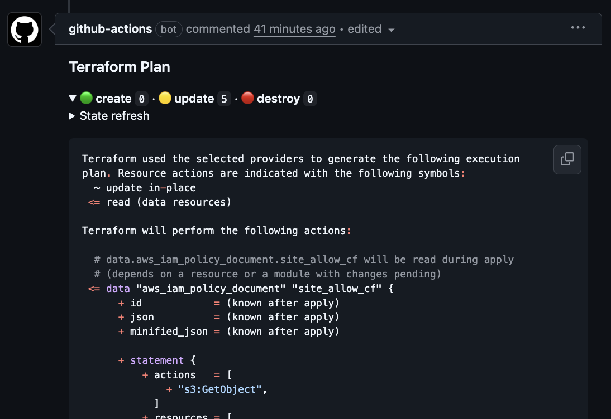

# Terraform Plan Commenter Action

[](https://github.com/thekbb/terraform-plan-commenter-action/actions/workflows/test.yml)
[](https://codecov.io/gh/thekbb/terraform-plan-commenter-action)
[](https://opensource.org/licenses/MIT)

A GitHub Action that runs `terraform plan` and posts a formatted comment to your pull request.
Subsequent pushes to the PR's branch will update the existing comment with the latest plan.

This makes it easy for reviewers (who won't have access to run terraform plan)
to quickly and easily see what infrastructure changes would be applied by the PR.



## Features

- Updates existing comments instead of creating duplicates
- Collapsible plan output section
- handles large plans gracefully-ish with truncation
- Shows plan summary, count of import/create/update/destroy
- Multi-directory support via `working-directory` input (for mono repos)
- Terraform workspace support - works with multiple workspaces (dev/staging/prod)
- Accessibility themes - colorblind-friendly emoji options

## Usage

```yaml
name: Terraform Plan

on:
  pull_request:
    branches: [main]

jobs:
  plan:
    runs-on: ubuntu-latest
    concurrency:
      group: terraform
      cancel-in-progress: false
    permissions:
      contents: read
      pull-requests: write
      id-token: write  # If using OIDC

    steps:
      - uses: actions/checkout@v6
        with:
          persist-credentials: false

      # Configure your cloud credentials (example: AWS OIDC)
      - uses: aws-actions/configure-aws-credentials@v5
        with:
          role-to-assume: arn:aws:iam::${{ vars.AWS_ACCOUNT_ID }}:role/my-role
          aws-region: us-east-2

      # Run the plan
      # Prefer a full 40-character commit SHA in production. Keep the release tag
      # in a trailing comment for human review.
      - uses: thekbb/terraform-plan-commenter-action@<full-commit-sha> # v1.2.1
        with:
          init-args: '-lockfile=readonly'
```

That is the recommended starting point:

- trigger on `pull_request`, not `pull_request_target`
- grant only the permissions the job needs
- use a full 40-character commit SHA if you want an immutable workflow reference
- keep the release tag in a trailing comment so humans can see the intended version quickly

## Inputs

| Input | Description | Required | Default |
| ----- | ----------- | -------- | ------- |
| `github-token` | GitHub token for posting PR comments | No | `${{ github.token }}` |
| `working-directory` | Directory containing Terraform configuration | No | `.` |
| `terraform-version` | Terraform version to use | No | `latest` |
| `setup-terraform` | Whether to setup Terraform (set `false` if already configured) | No | `true` |
| `init-args` | Trusted-only additional arguments for `terraform init` | No | `''` |
| `plan-args` | Trusted-only additional arguments for `terraform plan` | No | `''` |
| `summary-theme` | Emoji theme: `default`, `colorblind`, or `minimal` | No | `default` |

Use `init-args` and `plan-args` only for trusted, repo-controlled values.

## Outputs

| Output | Description |
| ------ | ----------- |
| `plan-exit-code` | Exit code from terraform plan (`0`=no changes, `1`=error, `2`=changes) |
| `has-changes` | Whether the plan has changes (`true`/`false`) |

## Examples

### Concurrency

Though Terraform state locking protects against concurrent runs, multiple commits in the same PR, multiple PRs, or a
Terraform apply from another GitHub Action can still collide and may require manually unlocking state.

You should use GitHub actions concurrency to queue up jobs. You'll need to get fancier
if you have multiple workspaces, or a matrix setup - action inputs and matrix values will help make the group name.

```yaml
concurrency:
  group: terraform
  cancel-in-progress: false
```

### Specific Terraform Version

```yaml
- uses: thekbb/terraform-plan-commenter-action@v1
  with:
    init-args: '-lockfile=readonly'
    terraform-version: '1.14.3'
```

### Subdirectory / Monorepo

```yaml
- uses: thekbb/terraform-plan-commenter-action@v1
  with:
    init-args: '-lockfile=readonly'
    working-directory: 'infrastructure/'
```

### Var Files

```yaml
- uses: thekbb/terraform-plan-commenter-action@v1
  with:
    init-args: '-lockfile=readonly'
    plan-args: '-var-file=prod.tfvars'
```

### Skip Terraform Setup

If you're using a matrix or already have Terraform configured:

```yaml
- uses: hashicorp/setup-terraform@v3
  with:
    terraform_version: '1.14.3'
    terraform_wrapper: false  # Important if capturing output

- uses: thekbb/terraform-plan-commenter-action@v1
  with:
    init-args: '-lockfile=readonly'
    setup-terraform: 'false'
```

### Colorblind-Friendly Theme

```yaml
- uses: thekbb/terraform-plan-commenter-action@v1
  with:
    init-args: '-lockfile=readonly'
    summary-theme: 'colorblind'
```

Available themes:

| Theme | Import | Create | Update | Destroy |
| ----- | ------ | ------ | ------ | ------- |
| `default` | 🔵 | 🟢 | 🟡 | 🔴 |
| `colorblind` | 📥 | ➕ | ✏️ | ➖ |
| `minimal` | [import] | [create] | [update] | [destroy] |

## Workspaces

The action automatically detects your Terraform workspace:

- **Workspaces**: Detects the current workspace (via `terraform workspace show`) and creates separate comments for
  each workspace (dev/staging/prod)
- **Monorepos**: Each `working-directory` gets its own independent comment
- **Matrix builds**: Jobs running different workspace/directory combinations maintain
  separate comments

### Running in a specific workspace

Select the workspace before running the action:

```yaml
- name: Select Terraform workspace
  run: terraform workspace select staging || terraform workspace new staging
  working-directory: ./infrastructure

- uses: thekbb/terraform-plan-commenter-action@v1
  with:
    init-args: '-lockfile=readonly'
    working-directory: ./infrastructure
```

### Matrix example (multiple workspaces)

```yaml
concurrency:
  group: terraform
  cancel-in-progress: false

strategy:
  matrix:
    workspace: [dev, staging, prod]

steps:
  - uses: actions/checkout@v6
    with:
      persist-credentials: false

  - name: Configure AWS
    uses: aws-actions/configure-aws-credentials@v5
    with:
      role-to-assume: arn:aws:iam::${{ vars.AWS_ACCOUNT_ID }}:role/terraform-${{ matrix.workspace }}
      aws-region: us-east-1

  - name: Select workspace
    run: terraform workspace select ${{ matrix.workspace }} || terraform workspace new ${{ matrix.workspace }}

  - uses: thekbb/terraform-plan-commenter-action@v1
    with:
      init-args: '-lockfile=readonly'
```

Each workspace gets its own independent PR comment that updates separately!

## PR Comment Preview

The action posts a comment like this:

> ### Terraform Plan
>
> <details><summary>🔵 <b>import</b> <code>2</code> · 🟢 <b>create</b> <code>3</code> ·
> 🟡 <b>update</b> <code>1</code> · 🔴 <b>destroy</b> <code>0</code></summary>
>
> ```terraform
> Terraform used the selected providers to generate the following execution plan:
> ```
>
> </details>
>
> *Pusher: @username, Action: `pull_request`*

## Update Strategy

For security, prefer a full 40-character commit SHA over a moving tag such as `@v1`. GitHub recommends full-length
commit SHAs as the immutable option for third-party actions in its
[Secure use reference](https://docs.github.com/en/actions/reference/security/secure-use). If you want automatic
updates while still using immutable workflow references, enable Dependabot for GitHub Actions in your repository:

```yaml
# .github/dependabot.yml
version: 2
updates:
  - package-ecosystem: 'github-actions'
    directory: '/'
    schedule:
      interval: 'weekly'
```

Dependabot updates workflow `uses:` references in `.github/workflows`, including commit SHAs for GitHub Actions. The
trailing `# v1.2.1` comment is mainly for human review so maintainers can see which release a referenced SHA
corresponds to.

Use a release-specific tag such as `@v1.2.1` if you want a human-readable reference to a single published release. Use
`@v1` only if you deliberately want the convenience of a moving major tag. For GitHub's model for combining fixed
release tags with movable major tags, see
[Using immutable releases and tags to manage your action's releases](https://docs.github.com/en/actions/how-tos/create-and-publish-actions/using-immutable-releases-and-tags-to-manage-your-actions-releases).

## Security & Trust

- **Default token friendly** - `github-token` defaults to `${{ github.token }}`
- **Minimal permissions** - the action only needs the permissions granted to the job that invokes it
- **GitHub-aligned workflow security guidance** - GitHub recommends full commit SHAs for third-party actions in its
  [Secure use reference](https://docs.github.com/en/actions/reference/security/secure-use)
- **Immutable workflow references available** - prefer a full 40-character commit SHA for production workflows
- **Signed release tags** - release tags are signed with the published project GPG key
- **Published release signing key** - import [`keys/release-signing-key.asc`](keys/release-signing-key.asc) before
  verifying a tag
- **Release verification before publication** - draft releases are verified from
  the signed tag before they are made public
- **Moving major tag is explicit** - `@v1` is intentionally movable and should not be treated as an immutable
  reference

```yaml
- uses: thekbb/terraform-plan-commenter-action@<full-commit-sha>
  with:
    init-args: '-lockfile=readonly'
```

If you prefer a release-specific tag in `uses:`, pin to the current release instead:

```yaml
- uses: thekbb/terraform-plan-commenter-action@v1.2.2
  with:
    init-args: '-lockfile=readonly'
```

## Release Process

This repository uses a workflow-driven release flow while keeping release tags
local and GPG-signed by the maintainer.

The release path is:

1. `Prepare Release` runs from `main` and opens or updates a
   `release-candidate/vX.Y.Z` pull request.
2. The release-candidate pull request is reviewed and merged.
3. The maintainer creates and pushes the signed `vX.Y.Z` tag from the merged
   `main` commit and moves the major tag such as `v1`.
4. The maintainer creates a draft GitHub release for `vX.Y.Z`.
5. `Verify Draft Release` is run from the `vX.Y.Z` tag and verifies the signed
   tag, release metadata, and draft-release state.
6. `Publish Verified Release` re-checks those release invariants and then
   publishes the draft release.

This repository publishes a [composite action](https://docs.github.com/en/actions/creating-actions/creating-a-composite-action),
so it does not produce a generated release artifact. The release verification
flow is therefore focused on signed tags and source-release integrity rather
than artifact attestation.

## Verify a Release

Release tags in this repository are signed with the GPG key whose public half is included at
[`keys/release-signing-key.asc`](keys/release-signing-key.asc).

Fingerprint:

```text
353A AFB2 1CE8 1D84 3634 AD3E DE52 EEA6 AF0D 8779
```

To verify a release tag locally:

```bash
gpg --import keys/release-signing-key.asc
gpg --show-keys --fingerprint keys/release-signing-key.asc
git fetch origin --tags --force
git verify-tag v1.2.1
git rev-parse v1.2.1^{commit}
```

You can also verify that the release tag points to code that is on `main`:

```bash
git fetch origin main --tags --force
git merge-base --is-ancestor "$(git rev-parse v1.2.1^{commit})" origin/main
```

If that command exits successfully, the release commit is reachable from
`origin/main`.

For an additional cross-check, you can confirm the same public key is published on `keys.openpgp.org` for
`kevin@thekbb.net`:

```bash
gpg --keyserver hkps://keys.openpgp.org --search-keys kevin@thekbb.net
```

The fingerprint should still match exactly:

```text
353A AFB2 1CE8 1D84 3634 AD3E DE52 EEA6 AF0D 8779
```

## Contributing

See [CONTRIBUTING.md](CONTRIBUTING.md) for development setup.
