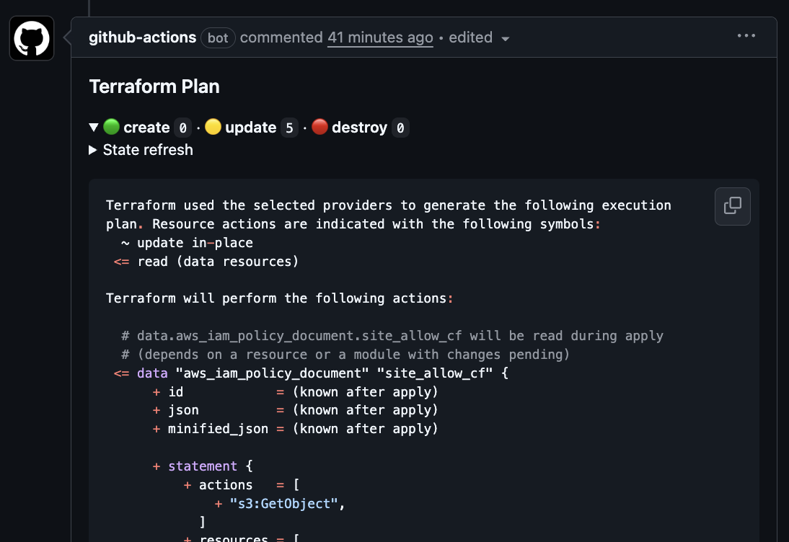

# Terraform Plan Commenter Action

[](https://github.com/thekbb/terraform-plan-commenter-action/actions/workflows/test.yml)
[](https://codecov.io/gh/thekbb/terraform-plan-commenter-action)
[](https://opensource.org/licenses/MIT)

Runs `terraform plan` and posts the result to your pull request. Reviewers can
see the proposed changes without running Terraform themselves.

Each directory/workspace pair gets its own comment. Later runs update that
comment with the latest plan. The summary shows imports, creates, updates, and
destroys; the full plan sits in a collapsible section. Plans too large for a
comment get a summary and a link to the workflow logs instead.



## Usage

This example uses AWS OIDC. Replace the role and region with your own, or use
your provider's authentication step. Replace `<full-commit-sha>` with the
reviewed release commit you want to run.

Commit `.terraform.lock.hcl` before using `-lockfile=readonly`. The runner needs
access to your backend, providers, modules, and the infrastructure being planned.

```yaml
name: Terraform Plan

on:
  pull_request:
    branches: [main]

jobs:
  plan:
    runs-on: ubuntu-latest
    concurrency:
      group: terraform
      cancel-in-progress: false
    permissions:
      contents: read
      pull-requests: write
      id-token: write  # For AWS OIDC, not PR comments

    steps:
      - uses: actions/checkout@v6
        with:
          persist-credentials: false

      - name: Configure AWS credentials
        uses: aws-actions/configure-aws-credentials@v5
        with:
          role-to-assume: arn:aws:iam::${{ vars.AWS_ACCOUNT_ID }}:role/my-role
          aws-region: us-east-2

      - uses: thekbb/terraform-plan-commenter-action@<full-commit-sha> # v2.0.0
        with:
          terraform-version: '1.14.3'
          init-args: '-lockfile=readonly'
```

The examples use Terraform `1.14.3`, matching the hosted tests. Choose a version
that works with your configuration and pin it. Omitting `terraform-version`
still uses `latest`.

### Permissions and trust

`pull-requests: write` is needed to post comments. `contents: read` lets checkout
read the repository. Cloud authentication is separate; grant `id-token: write`
only when your authentication step uses OIDC. The default `${{ github.token }}`
is enough for commenting when the job has permission.

Use this with Terraform code you trust. The action runs that code with the
credentials available to the job, and posts plan output where anyone who can
read the PR can see it. Sensitive values may be redacted by Terraform, but
resource names, identifiers, and other operational details can still appear.

Keep `init-args`, `plan-args`, and `COMMENT_NOTE` workflow-controlled. Do not
fill them from PR titles, descriptions, comments, or other untrusted input.

Use `pull_request`, not `pull_request_target`, for these examples. Fork PRs
normally receive a read-only token and no repository secrets, so this workflow
cannot generally plan and post comments for them. Do not switch to
`pull_request_target` just to get credentials or comment permissions for
untrusted code. See [GitHub's fork workflow restrictions][fork-workflows] and
[SECURITY.md](SECURITY.md) for the trust limits.

### Supported runners

Linux is the supported runner platform. The end-to-end tests run on
GitHub-hosted Ubuntu (`ubuntu-latest`). Self-hosted Linux runners are not covered
by those tests; keep the runner current and provide the tools and network
access required by your Terraform configuration. macOS and Windows are not
supported or tested for running the action.

The action installs Terraform unless `setup-terraform` is `false`. If you skip
setup, Terraform must already be on `PATH`, with the Terraform wrapper disabled.

## Inputs

| Input | Description | Required | Default |
| ----- | ----------- | -------- | ------- |
| `github-token` | GitHub token for posting PR comments | No | `${{ github.token }}` |
| `working-directory` | Directory containing Terraform configuration | No | `.` |
| `terraform-version` | Terraform version to use | No | `latest` |
| `setup-terraform` | Whether to install Terraform (`false` if already configured) | No | `true` |
| `init-args` | Trusted-only additional arguments for `terraform init` | No | `''` |
| `plan-args` | Trusted-only additional arguments for `terraform plan` | No | `''` |
| `summary-theme` | Emoji theme: `default`, `colorblind`, or `minimal` | No | `default` |

`setup-terraform` and `summary-theme` are validated before setup or
initialization. Their values are case-sensitive and are not trimmed. Omitted
or empty values use the defaults; other values fail with an input-specific
error instead of silently skipping setup or changing themes.

## Outputs

| Output | Description |
| ------ | ----------- |
| `plan-exit-code` | Terraform plan exit code: `0` = no changes, `1` = error, `2` = changes |
| `has-changes` | Whether Terraform reported changes: `true` or `false` |

Terraform exits `0` and `2` allow the action to succeed. Exit `1` posts a failure
comment on pull requests, then fails the action. Workspace detection, temporary
file, output capture, or unexpected Terraform exit failures stop the action
without posting a comment or reporting a valid `plan-exit-code`.

Check the action's outcome as well as its outputs. `has-changes: false` does not
mean the plan succeeded. A missing or malformed recorded exit code is an error,
not a successful no-change plan.

## Examples

These snippets use release tags to keep them readable. Use full commit SHAs
for third-party actions in production; see [Update Strategy](#update-strategy).

### Subdirectory / Monorepo

```yaml
- uses: thekbb/terraform-plan-commenter-action@v2.1.1
  with:
    terraform-version: '1.14.3'
    working-directory: 'infrastructure/'
    init-args: '-lockfile=readonly'
```

### Var Files

```yaml
- uses: thekbb/terraform-plan-commenter-action@v2.1.1
  with:
    terraform-version: '1.14.3'
    init-args: '-lockfile=readonly'
    plan-args: '-var-file=prod.tfvars'
```

### Skip Terraform Setup

If Terraform is already installed, set `setup-terraform: 'false'`. When using
`hashicorp/setup-terraform`, disable its wrapper: this action captures output
itself.

```yaml
- uses: hashicorp/setup-terraform@v4.0.1
  with:
    terraform_version: '1.14.3'
    terraform_wrapper: false

- uses: thekbb/terraform-plan-commenter-action@v2.1.1
  with:
    setup-terraform: 'false'
    init-args: '-lockfile=readonly'
```

Skipping setup does not skip `terraform init`.

### Colorblind-Friendly Theme

```yaml
- uses: thekbb/terraform-plan-commenter-action@v2.1.1
  with:
    terraform-version: '1.14.3'
    init-args: '-lockfile=readonly'
    summary-theme: 'colorblind'
```

| Theme | Import | Create | Update | Destroy |
| ----- | ------ | ------ | ------- | ------- |
| `default` | 🔵 | 🟢 | 🟡 | 🔴 |
| `colorblind` | 📥 | ➕ | ✏️ | ➖ |
| `minimal` | [import] | [create] | [update] | [destroy] |

## Workspaces

The action reads the current workspace with `terraform workspace show`. Each
directory/workspace pair gets a separate comment.

### Running in a specific workspace

For an existing workspace, set `TF_WORKSPACE` on the action step. Terraform
uses it during initialization and planning. This selects a workspace; it does
not create one. See [Terraform's `TF_WORKSPACE` documentation][tf-workspace].

```yaml
- uses: thekbb/terraform-plan-commenter-action@v2.1.1
  env:
    TF_WORKSPACE: staging
  with:
    terraform-version: '1.14.3'
    working-directory: ./infrastructure
    init-args: '-lockfile=readonly'
```

### Matrix example (multiple workspaces)

Replace the `plan` job in the starter workflow with this job. It assumes the
backend already has `dev`, `staging`, and `prod` workspaces. Configure the AWS
roles and region for your repository.

```yaml
plan:
  runs-on: ubuntu-latest
  strategy:
    matrix:
      workspace: [dev, staging, prod]
  concurrency:
    group: terraform-${{ matrix.workspace }}
    cancel-in-progress: false
  permissions:
    contents: read
    pull-requests: write
    id-token: write
  steps:
    - uses: actions/checkout@v6
      with:
        persist-credentials: false

    - name: Configure AWS credentials
      uses: aws-actions/configure-aws-credentials@v5
      with:
        role-to-assume: arn:aws:iam::${{ vars.AWS_ACCOUNT_ID }}:role/terraform-${{ matrix.workspace }}
        aws-region: us-east-2

    - uses: thekbb/terraform-plan-commenter-action@v2.1.1
      env:
        TF_WORKSPACE: ${{ matrix.workspace }}
      with:
        terraform-version: '1.14.3'
        init-args: '-lockfile=readonly'
```

## Comment Ownership and Identity

The supplied token determines the comment author, not the person who triggered
the workflow. The default `GITHUB_TOKEN`, personal access tokens, and GitHub App
installation tokens use GitHub's authenticated identity lookup. The action only
updates comments with that author's numeric ID and a matching leading marker.
If identity lookup fails, commenting fails rather than guessing an author.
The token still needs permission to read and write PR comments.

Each directory/workspace pair has a versioned, SHA-256-based marker. Equivalent
spellings such as `infra/prod`, `./infra/prod/`, `infra//prod`, `infra/./prod`,
and `infra/prod/.` share an identity. `infra/prod` and `infra-prod` do not;
neither do the repository root and a directory literally named `root`.
Whitespace in directory names is preserved. Parent (`..`) segments and symlink
aliases are not collapsed. Hashing encodes the identity; it does not hide
directory names already displayed in the comment or plan.

During v2, existing comments with legacy markers or earlier hashed dot-segment
spellings can be upgraded in place only when the authenticated author matches
and the original Terraform Plan header confirms the directory. Ambiguous or
edited legacy headers are left untouched and a new comment is created.
Switching token authors also creates a new comment; comments belonging to the
previous author are not adopted.

If multiple owned comments match, the action prefers the new marker format,
updates the lowest comment ID within that format, and warns about duplicates.
Other comments are never deleted. Legacy migration support is limited to v2;
future removal belongs in a major release.

### Concurrency

Use GitHub Actions concurrency to avoid overlapping runs against the same
state. The starter example uses one group for all plans; the matrix example
uses one per workspace. Match the group used by other workflows, including
apply workflows, that access the same state. Terraform state locking still
applies.

For independent states, you can group comment updates by PR, directory, and
workspace instead. For a job with `directory` and `workspace` matrix values:

```yaml
concurrency:
  group: plan-${{ github.event.pull_request.number }}-${{ matrix.directory }}-${{ matrix.workspace }}
  cancel-in-progress: false
```

Use the same group across workflows that update the same plan comment. This
reduces creation races but does not merge existing duplicates. PR-scoped
concurrency does not serialize other PRs or apply jobs against a shared state.

## Comment Rendering

Plan output stays inside a Terraform code block, even when it contains
backticks, HTML-like text, or mentions. Directory names use inline code with
visible escapes for line breaks and control characters; literal backslashes
are escaped too. These display changes do not change comment identity.

`COMMENT_NOTE`, when set by the workflow, remains trusted Markdown. Do not
populate it from untrusted pull-request content.

## Troubleshooting

### No comment or permission denied

Comments are posted only for `pull_request` events after a recorded plan exit
code of `0`, `1`, or `2`. Check the setup, init, and plan steps first, then check
the token's PR permissions. Fork restrictions still apply even if the workflow
requests `pull-requests: write`.

An authenticated-author lookup failure stops commenting. The action does not
fall back to matching arbitrary bot comments.

### A new comment appeared instead of an update

Check whether the token author, directory, or workspace changed. Legacy
comments with edited or ambiguous headers are left alone. The workflow logs
include the comment ID and URL after a successful create, update, or migration.
See [Comment Ownership and Identity](#comment-ownership-and-identity).

### The full plan is missing

When the rendered comment exceeds the action's 65,000-character limit, the
action omits the full plan and logs a warning with its size. Read the Terraform
Plan step's logs for the full output. The comment links to that run when the
GitHub server URL is available.

### Invalid input or missing workspace

Use the exact `setup-terraform` and `summary-theme` values listed above; for
example, `false`, not `flase`. If using `TF_WORKSPACE`, check that the workspace
exists in the configured backend and the credentials can access it.

With `-lockfile=readonly`, initialization can also fail if the provider lock
file needs updating. Update and review it locally, then commit it.

## Update Strategy

Use a full 40-character commit SHA for an immutable action reference. Keep the
release tag in a trailing comment so you can see what the SHA refers to. This
also applies to checkout and credential actions. See [GitHub's secure use reference][secure-use].

Use a release-specific tag such as `@v2.0.0` if you prefer a readable release
reference. A major tag such as `@v2` moves with releases; it is not immutable.
See [GitHub's release and tag guidance][immutable-releases].

Dependabot can propose updates to action references, including SHA pins:

```yaml
# .github/dependabot.yml
version: 2
updates:
  - package-ecosystem: 'github-actions'
    directory: '/'
    schedule:
      interval: 'weekly'
```

## Verify a Release

Release tags are signed with the key in
[`keys/release-signing-key.asc`](keys/release-signing-key.asc). Its fingerprint is:

```text
353A AFB2 1CE8 1D84 3634 AD3E DE52 EEA6 AF0D 8779
```

Use a trusted checkout of the verifier with Git, GPG, curl, Node.js 24, and an
authenticated GitHub CLI that supports [attestation verification][gh-attestation].
No npm installation is needed. Replace the version placeholder:

```bash
./verify-release.sh --tag vX.Y.Z
```

The script checks the signed annotated tag, the commit's reachability from
`origin/main`, immutable publication, and provenance for every `dist/*.js`
file. It uses the helper from your trusted checkout, not code from the fetched
release. Verification by `--sha` also requires a version tag pointing at that
commit. Releases without runtime attestations fail the provenance check.

The signed tag covers the complete action commit. Build provenance covers
only generated `dist/*.js`, not `action.yml`, shell steps, Terraform, providers,
modules, or nested actions. Neither proves your Terraform configuration is
safe. See [SECURITY.md](SECURITY.md) for the verification policy and limits.

## Contributing

See [CONTRIBUTING.md](CONTRIBUTING.md) for development setup, generated runtime
checks, and the [release procedure](CONTRIBUTING.md#releases).

[fork-workflows]: https://docs.github.com/en/actions/reference/workflows-and-actions/events-that-trigger-workflows#workflows-in-forked-repositories
[tf-workspace]: https://developer.hashicorp.com/terraform/cli/config/environment-variables#tf_workspace
[secure-use]: https://docs.github.com/en/actions/reference/security/secure-use
[immutable-releases]: https://docs.github.com/en/actions/how-tos/create-and-publish-actions/using-immutable-releases-and-tags-to-manage-your-actions-releases
[gh-attestation]: https://cli.github.com/manual/gh_attestation_verify
